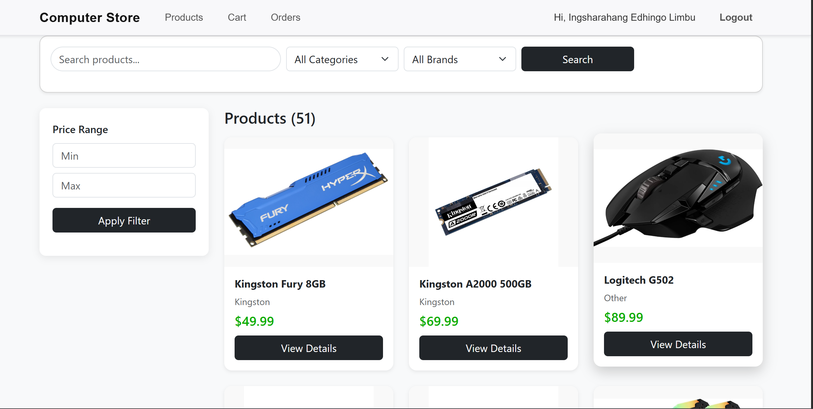
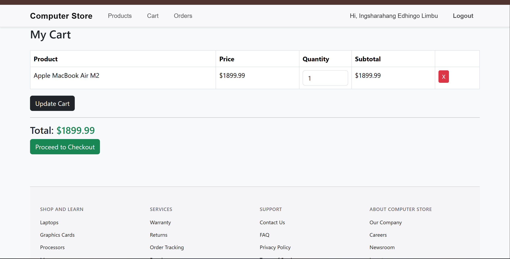
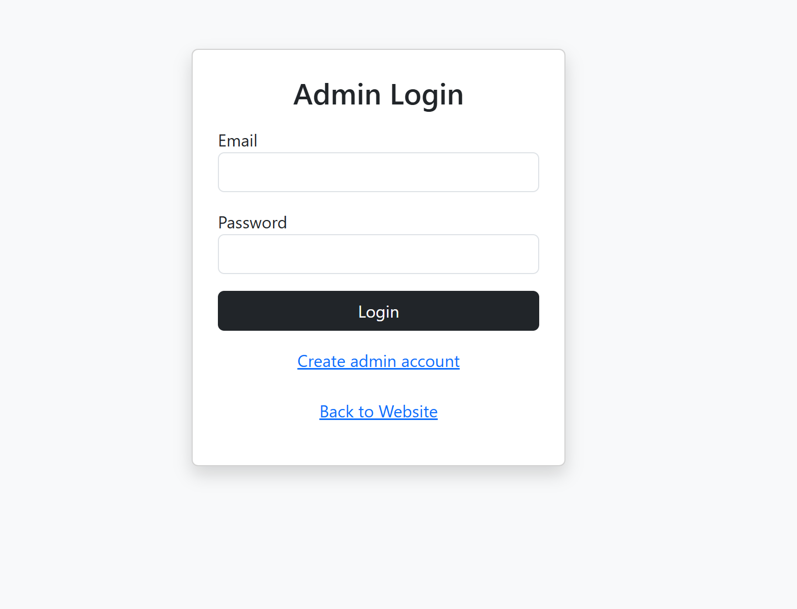

# Online Computer Store

## Project Description

This is a full-stack web application that simulates an online computer store.  
Users can browse products by category, add items to a shopping cart, and place orders through a checkout flow.  
Admins can manage products (add/edit/delete) and view customer orders.

## Technologies Used

- PHP (server-side)
- MySQL (database)
- HTML5, CSS3, Bootstrap 5
- JavaScript (client-side)

## Setup Instructions

### 1. Requirements

- XAMPP/WAMP/MAMP (PHP + MySQL)
- Web browser

### 2. Install Project

1. Copy the project folder into your web server directory, e.g.:

   `C:\XAMPP\htdocs\ONLINE_STORE`

2. Start **Apache** and **MySQL** in XAMPP.

### 3. Database Setup

1. Open `http://localhost/phpmyadmin`.
2. Create a new database (for example): `computer_store`.
3. Click **Import**.
4. Choose the file: `computer_store.sql` (included in this repo).
5. Click **Go** to import tables and sample data.

### 4. Configure Database Connection

Open `db.php` and adjust these values if needed:

```php
$host = "localhost";
$user = "root";
$pass = "";
$port = "3307";
$dbname = "computer_store";

#login Information
#Admin
Email: kushanglimbu123@gmail.com
password: @sukuna258@@

#User
Email: kushanglimbu@gmail.com
password: @sukuna258@@

## Author
Name: Ingsharahang Edhingo Limbu, Rajiv Kumar Limbu
Student ID: 5144361, 5144378
```

## Screenshots

### Homepage


### Products Page



### Cart Page



### Admin Dashboard


